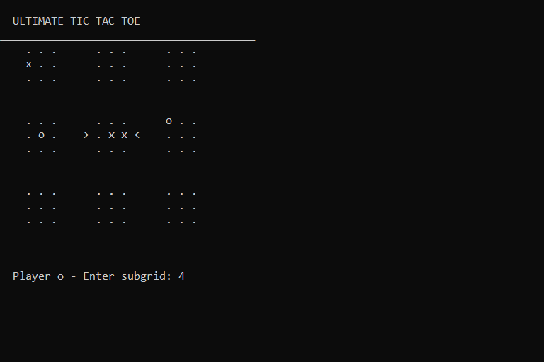

# Ultimate Tic Tac Toe

This is an implementation of Ultimate Tic Tac Toe game in command line. I created this game as a part of High School (Class 12) Project in 2017. The project required us to use modular programming concepts to build maintainable and modifiable applications.

Rules of the game can be found on [Wikipedia](https://en.wikipedia.org/wiki/Ultimate_tic-tac-toe) and also on this nicely illustrated website: [Math with Bad Drawings](https://mathwithbaddrawings.com/2013/06/16/ultimate-tic-tac-toe/).

This version of the game does not implement the global board victory, so when a player wins in one of the local boards, they win the game.
Also this implementation uses `system(cls)` *clear* the screen, which only works on Windows. So unfortunately the clearing function will not work properly on other OSes.
